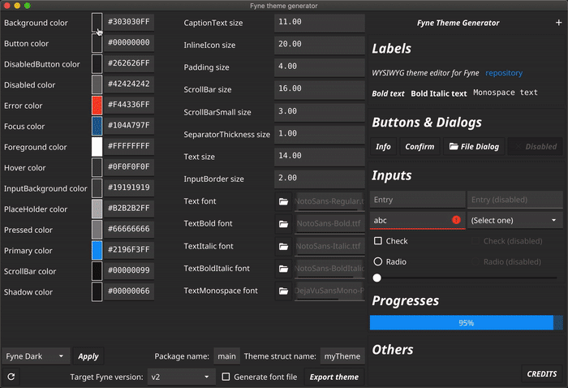
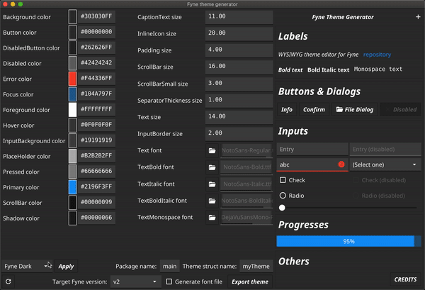

fyne-theme-generator
====

WYSIWYG theme editor for [Fyne](https://fyne.io/)



## Installation

`go get github.com/lusingander/fyne-theme-generator`

## Usage

You can change each parameter that can be set as Fyne theme.


### Default themes

You can choose a new theme from Fine v1.4 or later, or an earlier theme and apply and customize it.



### Fonts

You can also change the font, and export font bundled file.


### Export

You can export the theme file as `theme_gen.go` you set.

If the `Generate font file` is checked, the font file is also exported as `font_gen.go` (It will not be exported if you have not changed any of the fonts).

The following is an example of the output `theme_gen.go`.

```go
package main

import (
	"image/color"

	"fyne.io/fyne/v2"
	"fyne.io/fyne/v2/theme"
)

type myTheme struct{}

func (myTheme) Color(c fyne.ThemeColorName, v fyne.ThemeVariant) color.Color {
	switch c {
	case theme.ColorNameBackground:
		return color.NRGBA{R: 0x30, G: 0x30, B: 0x30, A: 0xff}
	case theme.ColorNameButton:
		return color.Alpha16{A: 0x0}
	case theme.ColorNameDisabledButton:
		return color.NRGBA{R: 0x26, G: 0x26, B: 0x26, A: 0xff}
	case theme.ColorNameDisabled:
		return color.NRGBA{R: 0xff, G: 0xff, B: 0xff, A: 0x42}
	case theme.ColorNameError:
		return color.NRGBA{R: 0xf4, G: 0x43, B: 0x36, A: 0xff}
	case theme.ColorNameFocus:
		return color.NRGBA{R: 0x21, G: 0x96, B: 0xf3, A: 0x7f}
	case theme.ColorNameForeground:
		return color.NRGBA{R: 0xff, G: 0xff, B: 0xff, A: 0xff}
	case theme.ColorNameHover:
		return color.NRGBA{R: 0xff, G: 0xff, B: 0xff, A: 0xf}
	case theme.ColorNameInputBackground:
		return color.NRGBA{R: 0xff, G: 0xff, B: 0xff, A: 0x19}
	case theme.ColorNamePlaceHolder:
		return color.NRGBA{R: 0xb2, G: 0xb2, B: 0xb2, A: 0xff}
	case theme.ColorNamePressed:
		return color.NRGBA{R: 0xff, G: 0xff, B: 0xff, A: 0x66}
	case theme.ColorNamePrimary:
		return color.NRGBA{R: 0x21, G: 0x96, B: 0xf3, A: 0xff}
	case theme.ColorNameScrollBar:
		return color.NRGBA{R: 0x0, G: 0x0, B: 0x0, A: 0x99}
	case theme.ColorNameShadow:
		return color.NRGBA{R: 0x0, G: 0x0, B: 0x0, A: 0x66}
	default:
		return theme.DefaultTheme().Color(c, v)
	}
}

func (myTheme) Font(s fyne.TextStyle) fyne.Resource {
	if s.Monospace {
		return theme.DefaultTheme().Font(s)
	}
	if s.Bold {
		if s.Italic {
			return theme.DefaultTheme().Font(s)
		}
		return theme.DefaultTheme().Font(s)
	}
	if s.Italic {
		return theme.DefaultTheme().Font(s)
	}
	return theme.DefaultTheme().Font(s)
}

func (myTheme) Icon(n fyne.ThemeIconName) fyne.Resource {
	return theme.DefaultTheme().Icon(n)
}

func (myTheme) Size(s fyne.ThemeSizeName) float32 {
	switch s {
	case theme.SizeNameCaptionText:
		return 11
	case theme.SizeNameInlineIcon:
		return 20
	case theme.SizeNamePadding:
		return 4
	case theme.SizeNameScrollBar:
		return 16
	case theme.SizeNameScrollBarSmall:
		return 3
	case theme.SizeNameSeparatorThickness:
		return 1
	case theme.SizeNameText:
		return 14
	case theme.SizeNameInputBorder:
		return 2
	default:
		return theme.DefaultTheme().Size(s)
	}
}
```
