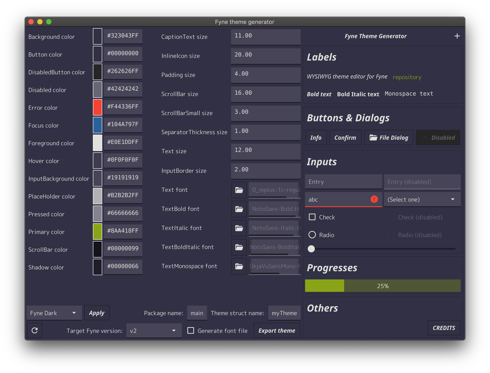

fyne-theme-generator
====

WYSIWYG theme editor for [Fyne](https://fyne.io/)


## Installation

`go get github.com/lusingander/fyne-theme-generator`

## Usage

You can change each parameter that can be set as Fyne theme.



> Note: Some of the parameters are not yet configurable or visible on the screen.

And you can export the theme file you set.

The following is an example of the output `theme_gen.go`.

```go
package main

import (
	"image/color"

	"fyne.io/fyne"
	"fyne.io/fyne/theme"
)

type myTheme struct{}

func (myTheme) BackgroundColor() color.Color      { return &color.RGBA{R: 0xa7, G: 0x86, B: 0x70, A: 0xff} }
func (myTheme) ButtonColor() color.Color          { return &color.RGBA{R: 0xb9, G: 0x75, B: 0x10, A: 0xff} }
func (myTheme) DisabledButtonColor() color.Color  { return &color.RGBA{R: 0x8e, G: 0x70, B: 0x36, A: 0xff} }
func (myTheme) TextColor() color.Color            { return &color.RGBA{R: 0xf4, G: 0xe6, B: 0xcf, A: 0xff} }
func (myTheme) DisabledTextColor() color.Color    { return &color.RGBA{R: 0xbb, G: 0xae, B: 0xa1, A: 0xff} }
func (myTheme) IconColor() color.Color            { return color.RGBA{R: 0xf4, G: 0xe6, B: 0xcf, A: 0xff} }
func (myTheme) DisabledIconColor() color.Color    { return color.RGBA{R: 0xbb, G: 0xae, B: 0xa1, A: 0xff} }
func (myTheme) HyperlinkColor() color.Color       { return &color.RGBA{R: 0x72, G: 0x51, B: 0x8e, A: 0xff} }
func (myTheme) PlaceHolderColor() color.Color     { return color.RGBA{R: 0xbb, G: 0xae, B: 0xa1, A: 0xff} }
func (myTheme) PrimaryColor() color.Color         { return color.RGBA{R: 0xd6, G: 0xb1, B: 0x11, A: 0xff} }
func (myTheme) HoverColor() color.Color           { return &color.RGBA{R: 0xdf, G: 0x89, B: 0x8, A: 0xff} }
func (myTheme) FocusColor() color.Color           { return &color.RGBA{R: 0xd6, G: 0xb1, B: 0x11, A: 0xff} }
func (myTheme) ScrollBarColor() color.Color       { return color.RGBA{R: 0x0, G: 0x0, B: 0x0, A: 0x55} }
func (myTheme) ShadowColor() color.Color          { return color.RGBA{R: 0x0, G: 0x0, B: 0x0, A: 0x33} }
func (myTheme) TextSize() int                     { return 12 }
func (myTheme) TextFont() fyne.Resource           { return theme.LightTheme().TextFont() }
func (myTheme) TextBoldFont() fyne.Resource       { return theme.LightTheme().TextBoldFont() }
func (myTheme) TextItalicFont() fyne.Resource     { return theme.LightTheme().TextItalicFont() }
func (myTheme) TextBoldItalicFont() fyne.Resource { return theme.LightTheme().TextBoldItalicFont() }
func (myTheme) TextMonospaceFont() fyne.Resource  { return theme.LightTheme().TextMonospaceFont() }
func (myTheme) Padding() int                      { return 3 }
func (myTheme) IconInlineSize() int               { return 20 }
func (myTheme) ScrollBarSize() int                { return 16 }
func (myTheme) ScrollBarSmallSize() int           { return 3 }
```
